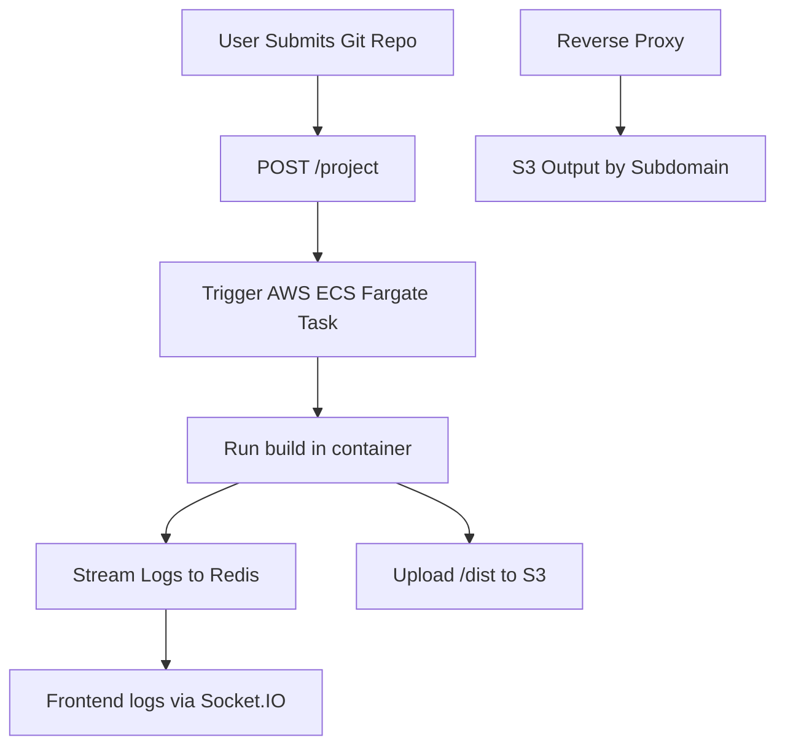

Here’s a **`README.md`** file tailored for your project, which includes Git repo build automation via AWS ECS, Redis log streaming, and S3-hosted static site delivery via reverse proxy:

---

````markdown
# ⚙️ VercelClone Builder System

A full-stack system that accepts Git repositories, builds them inside isolated AWS ECS Fargate containers, streams logs via Redis pub/sub, and serves the output via an S3-backed reverse proxy.

---

## 📦 Features

- 🔁 **Reverse Proxy**: Serves built project files from S3 based on subdomain routing.
- 🛠️ **Builder Script**: Installs and builds projects inside ECS containers.
- ☁️ **S3 Upload**: Stores built artifacts in an organized S3 folder structure.
- 📡 **Real-time Logs**: Streams build logs using Redis and Socket.IO.
- 🚀 **Git Integration**: Accepts any public Git repo URL for automated builds.

---

## 🏗️ Architecture Overview


````

---

## 🧪 Tech Stack

- **Node.js**
- **Express**
- **Socket.IO**
- **Redis (Redis Cloud)**
- **AWS ECS Fargate**
- **AWS S3**
- **AWS SDK v3**

---

## 🛠️ Local Development Setup

### 1. Clone the Repository

```bash
git clone https://github.com/nishith-b/deploy-now.git
cd deploy-now
```

### 2. Setup Environment Variables

Create `.env.api`, `.env.proxy`, and `.env.script` files based on the following:

<details>
<summary><code>.env.api</code></summary>

```env
PORT=4321

# Redis
REDIS_USERNAME=default
REDIS_PASSWORD=your_password
REDIS_HOST=your_redis_host
REDIS_PORT=15242

# AWS
AWS_ACCESS_KEY=your_key
AWS_SECRET_KEY=your_secret
AWS_REGION=ap-south-1
AWS_CLUSTER=your_cluster_arn
AWS_TASK=your_task_arn
AWS_S3_BUCKET=your_bucket
```

</details>

<details>
<summary><code>.env.proxy</code></summary>

```env
PORT=9000
BASE_PATH=https://your-bucket.s3.ap-south-1.amazonaws.com/_outputs
```

</details>

---

## 🚀 API Endpoints

### `POST /project`

Triggers a new ECS task to build a given Git repo.

#### Body

```json
{
  "gitURL": "https://github.com/user/project"
}
```

#### Response

```json
{
  "status": "Queued",
  "data": {
    "projectSlug": "cool-horse-ride",
    "url": "http://cool-horse-ride.localhost:9000"
  }
}
```

---

## 📦 Output Hosting via Proxy

Visit your output at:

```bash
http://<project-slug>.localhost:9000
```

> The reverse proxy rewrites `/` to `/index.html` and fetches files from S3 using `${BASE_PATH}/${projectSlug}`.

---

## 📡 Real-time Logs

Logs are published to Redis pub/sub channel `logs:<projectSlug>` and broadcast to all clients via Socket.IO.It can accessed via establishing a socket connection through postman.

```js
io.on("connection", (socket) => {
  socket.on("log", (data) => {
    console.log(`[${data.channel}] ${data.message}`);
  });
});
```

---

## 🛡️ Security Best Practices

- Rotate AWS access keys regularly or use IAM roles inside ECS.
- Never commit `.env` files — add them to `.gitignore`.
- Mask Redis and AWS secrets in logs.

---

## 📜 License

MIT License. Fork freely and build amazing deployment tools!

---

## 🙌 Contributions

PRs and suggestions are welcome! Please open issues or submit pull requests on GitHub.

```
---
Let me know if you’d like:
- A version with frontend setup instructions (if you have a UI).
- Deployment documentation (Docker, AWS setup, etc.).
- A visual badge version (build passing, ECS region, etc.).
```
